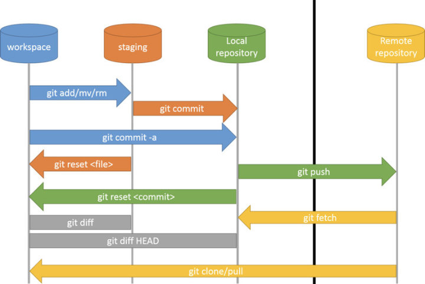

Git 按照场景可以分为以下场景（Scence）：

1.  Workspace：当前工作区，修改的的最初状态。
2.  Staging：修改后，添加到准备提交的缓存状态。
3.  Local repository：本地的代码仓库，只对自己的代码生效。这也是和 svn 区别之一，svn commit 之后就直接提交到远程服务器了，git commit 之后只是到本地代码库。
4.  Remote repository：远程代码库，将自己的本地代码库同步到远程代码库上，这样可以供别的开发者分享自己的成果。

