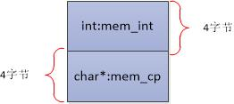
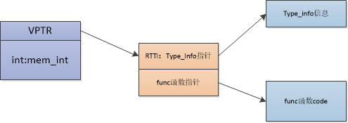

POD类型，说明该数据是普通的，不会有什么虚函数啊，虚继承啊，或者内嵌的数据类型很复杂的情况。也就是说，POD类型的C++变量，可以直接用C语言中的struct来解释。

如下代码所示：

```CPP
class PODType
{
    public:
        int mem_int;
        char* mem_cp;
};
```

PODType类型的内存布局如下的，POD类型太过于普通以至于使用简简单单的C语言结构体即可表示：



如果类型含有虚函数将会如何呢？比如：

```CPP
class NonPODType
{
    public:
        int mem_int;
        // 含有虚函数，内存布局中有虚表指针
        virtual int func() { return 0; }
};
```


NonPODType类型的内存布局如下所示，C语言内存布局中哪里来的虚表指针呢，C语言根本就无法解释这种情况：



直观的来书，**POD类型中的O代表了与C语言的兼容性，可以直接使用memcpy()直接复制而不会出现任何问题**。POD这个想法的由来就是要支持两种最基本的属性：
（1）支持静态初始化
（2）编译C++中的POD类型所得到的内存布局，和C中编译struct的内存布局相同

具体地，C++11将POD类型划分为两个概念：

trivial
standard layout

### Trivial平凡的

C++11提供了内置函数来支持Trivial类型的判断。

支持静态初始化，是拷贝不变的（trivially copyable）的class，可以使用memcpy， memmove不改变它的语义

- has no non-trivial [copy constructors](https://www.zhihu.com/search?q=copy+constructors&search_source=Entity&hybrid_search_source=Entity&hybrid_search_extra={"sourceType"%3A"answer"%2C"sourceId"%3A61877180}) (12.8),
- has no non-trivial move constructors (12.8),
- has no non-trivial copy assignment operators (13.5.3, 12.8),
- has no non-trivial move assignment operators (13.5.3, 12.8), and
- has a trivial destructor (12.4).

```cpp
template <typename T> struct std::is_trivial
    
struct A { int i; }; // C-struct (POD)
class B : public A 
{
    public:
    B() = default; 
    B(int i){}	// 不是缺省构造函数，不影响trivial属性
}; // still POD
struct C : B { void fn(){} }; // still POD (member function)
struct D : C { D(){} }; // no POD (custom default constructor)
```

### Standard Layout标准布局

standard-layout类型和C中struct或union类型有相同的内存布局

需满足以下要求：

- 所有**非静态成员拥有相同的访问级别，（**访问级别就是public，private，protected），

```cpp
// 不满足标准布局,因为a,b访问级别不同。
struct t1{
private : 
	int a; 
public:
	int b;
}
```

- **在类和结构体继承时需要满足以下两个情况之一：**

  - 派生类中有非静态类(这个槽)，那么这个派生类只能有且只有一个仅包含了静态成员的基类。(继承类有非静态成员，基类的成员只能是静态成员)
  - 基类有非静态成员，那么派生类中不允许有非静态成员。(基类和继承类只能有一个含有非静态成员)

- **没有虚类和虚基类（与trival中重复）**

- **类中第一个非静态类型与基类不是同一个类型**

  ```c++
  struct A:B{
  	B b;	// 第一个非静态成员是基类，不符合
  	int c;
  }
  ```

- **所有非静态数据成员都符合标准布局的要求，这其实就是一个递归的定义。**


所以在C++11中，POD就是满足平凡的（trival)和标准布局(standard layout)这两个方面。可以使用<type_traists>中的**std::is_trivial && std::is_standard_layout**判断。


### 为什么我们需要POD这种条件满足的数据呢？

1. 可以使用字节赋值，比如memset，memcpy操作
2. 对C内存布局兼容。
3. 保证了静态初始化的安全有效。

