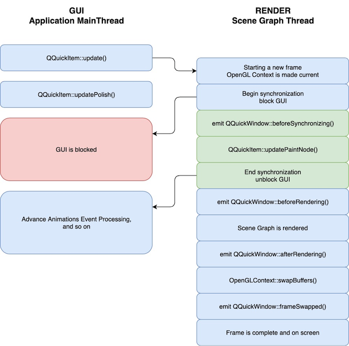

## QWidget & QQuickPaintedItem

- 使用继承的方式在paintEvent/paint里面drawImage，需要将YUIV数据转为RGB图片。
- 使用timer来决定刷新帧率，注意timer精度问题
- QQuickPaintedItem需要设置setFlag(QQuickItem::ItemHasContents)


## QQuickFramebufferObject

先渲染到帧缓冲FBO，再将帧缓冲FBO的内容拷贝到当前窗口。通过使用FBO的多重纹理采样，可以使画面更清晰。场景图渲染将在专用渲染线程上进行。这样做是为了提高多核处理器的并行性并更好地利用停顿时间

在大多数平台上，渲染将发生在**专用线程**上。出于这个原因，QQuickFramebufferObject 类强制在项目实现和 FBO 渲染之间进行严格分离。QML 需要的所有项目逻辑，例如属性和 UI 相关的辅助函数都应该位于 QQuickFramebufferObject 类子类中。与渲染相关的所有内容都必须位于QQuickFramebufferObject::Renderer类中。

项目和渲染器之间的通信应该主要通过QQuickFramebufferObject::Renderer::synchronize() 函数进行。当 GUI 线程被阻塞时，该函数将在渲染线程上调用

> **警告：**该类仅在 Qt Quick 通过 OpenGL 渲染时才起作用



- 视频控件继承QQuickFramebufferObject，createRenderer接口返回渲染类

- 渲染类继承QQuickFramebufferObject::Renderer，

- 项目和渲染器之间的通信应该主要通过QQuickFramebufferObject::Renderer::synchronize () 函数进行。当 GUI 线程被阻塞时，该函数将在渲染线程上调用

  ```c++
      // 传入的参数即视频控件类
  	void synchronize(QQuickFramebufferObject *item) override{
          VideoItem2 *pItem = qobject_cast<VideoItem2 *>(item);
          if (pItem)
          {
              if (!m_window)
              {
                  m_window = pItem->window();
              }
              if (pItem->infoDirty())
              {
                  m_render.updateTextureInfo(pItem->videoWidth(), pItem->videoHeght());
                  pItem->makeInfoDirty(false);
              }
              std::shared_ptr<YUVData> ba = pItem->getFrame();
              m_render.updateTextureData(ba);
          }
      }
  ```

- 继承Opengl接口api提供类QOpenGLFunctions，使用该类直接渲染纹理

- 如果要改变视频大小，createFramebufferObject返回纹理QOpenGLFramebufferObject

  ```c++
      QOpenGLFramebufferObject *createFramebufferObject(const QSize &size) override{
          QOpenGLFramebufferObjectFormat format;
          format.setAttachment(QOpenGLFramebufferObject::CombinedDepthStencil);
          format.setSamples(4);
          m_render.resize(size.width(), size.height());
          return new QOpenGLFramebufferObject(size, format);
      }
  ```


## VideoOutput

**用法1**

```html
Rectangle {
    width: 800
    height: 600
    color: "black"

    MediaPlayer {
        id: player
        source: "file://video.webm"
        autoPlay: true
    }

    VideoOutput {
        id: videoOutput
        source: player
        anchors.fill: parent
    }
}
```

**用法2**

- 视频提供类继承QObject，有QAbstractVideoSurface* 和QVideoSurfaceFormat成员变量

- 提供videoSurface属性返回QAbstractVideoSurface*成员变量，并提供setVideoSurface的设置接口

- 收到视频帧QVideoFrame时，第一次需要用QVideoSurfaceFormat设置视频格式及大小，然后调用present下视频帧，视频帧需要解码时准备好

  ```c++
  // 根据视频数据大小创建一个空闲位置
  QVideoFrame f(size, QSize(width, height), width, QVideoFrame::Format_YUV420P);
  //  map 这块位置到内存
  if (f.map(QAbstractVideoBuffer::WriteOnly)) {
      // 拷贝数据进去
      memcpy(f.bits(), data, size);
      f.setStartTime(0);
      // unmap 并发送信号给 provider 使用
      f.unmap();
      // 这里如果考虑性能问题，可以将 QVideoFrame 使用智能指针传递
      emit newFrameAvailable(f);
  }
  ```

  

- 实例对象并注册到QML中，将VideoOutput的source改为这个实例

**获取摄像头并保存帧数据**

https://blog.csdn.net/yangyang031213/article/details/86068746

## QVideoWidget

```c++
 player = new QMediaPlayer;

 playlist = new QMediaPlaylist(player);
 playlist->addMedia(QUrl("http://example.com/myclip1.mp4"));
 playlist->addMedia(QUrl("http://example.com/myclip2.mp4"));

 videoWidget = new QVideoWidget;
 player->setVideoOutput(videoWidget);

 videoWidget->show();
 playlist->setCurrentIndex(1);
 player->play();
```

