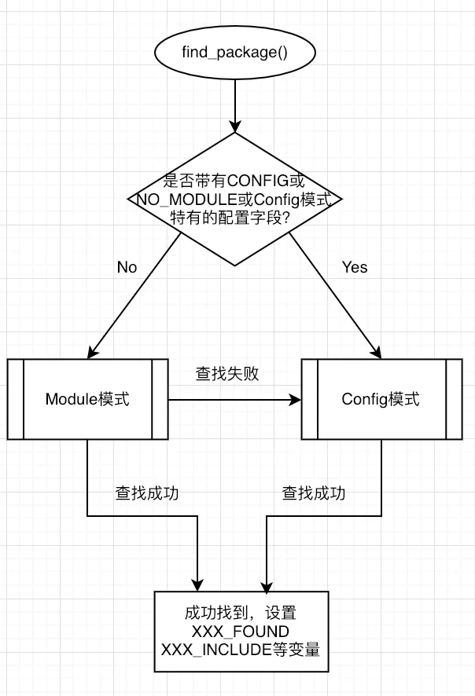

### 使用

```cmake
# 查找模块，使用cmake安装的库可以直接找到
find_package(fmt)
if(fmt_FOUND)
	# 查找成功后会有fmt_INCLUDE_DIR or fmt_INCLUDES
	# fmt_LIBRARY or fmt_LIBRARIES
    target_include_directories(${PROJECT_NAME} PRIVATE ${fmt_INCLUDE_DIR})
    target_link_libraries(${PROJECT_NAME} ${fmt_LIBRARY})
else()
    message(FATAL_ERROR ”CURL library not found”)
endif()
```


### 查询路径

默认（MODULE）在cmake安装目录下share/cmake/Modules查找Find<LibaryName>.cmake文件

如果指定或者没有在MODULE中查找到，则为CONFIG模式。查找路径为/usr/local/lib/cmake/<LibraryName>
```cmake
LIST(APPEND CMAKE_MODULE_PATH ${PROJECT_SOURCE_DIR}/modules)
```





##### **Module模式查找顺序**

Module模式下是要查找到名为Find.cmake的文件。

先在CMAKE_MODULE_PATH变量对应的路径中查找。如果路径为空，或者路径中查找失败，则在cmake module directory（cmake安装时的Modules目录，比如/usr/local/share/cmake/Modules或者/usr/local/lib/cmake/XXX/中的XXXConfig.cmake）查找

