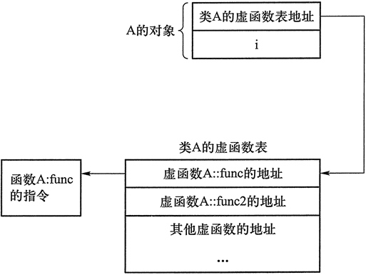

```c++
class A
{
public:
 void FuncA()
 {
     printf( "FuncA called\n" );
 }
 virtual void FuncB()
 {
     printf( "FuncB called\n" );
 }
};
class B : public A
{
public:
 void FuncA()
 {
     A::FuncA();
     printf( "FuncAB called\n" );
 }
 virtual void FuncB()
 {
     printf( "FuncBB called\n" );
 }
};
void main( void )
{
 B	b;
 A	*pb = &b;
 A *pa2 = new A;
 pb->FuncA(); （ 3） // 注意基类指针调用非虚函数时，不管指向类型是什么都会调用基类函数而非重载的函数
 pb->FuncB(); （ 4）
 pa2->FuncA(); （ 5）
 pa2->FuncB();
 delete pa2;
}
```

虚函数表指针位于对象的最前段


```cpp
#include <iostream>
using namespace std;
class A
{
public:
    int i;
    virtual void func() {}
    virtual void func2() {}
};
class B : public A
{
    int j;
    void func() {}
};
int main()
{
    cout << sizeof(A) << ", " << sizeof(B);  //输出 8,12
    return 0;
}
```
A和B的地址
 


