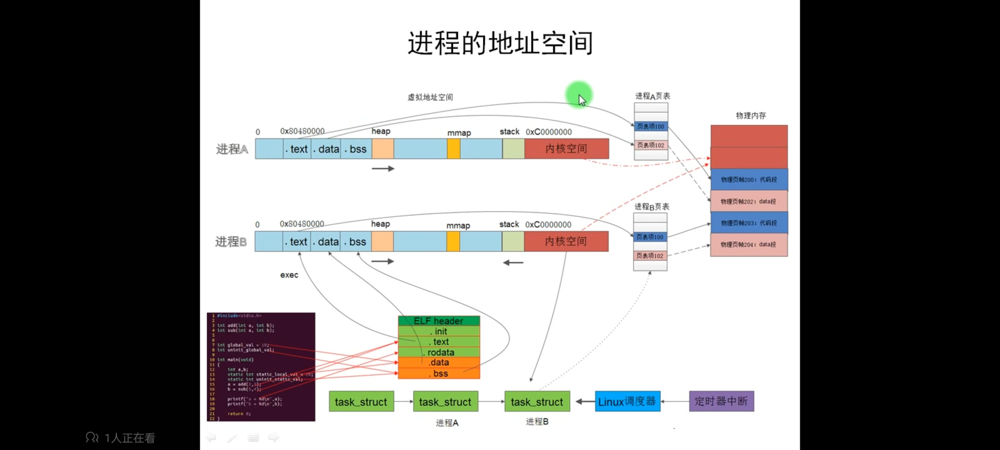
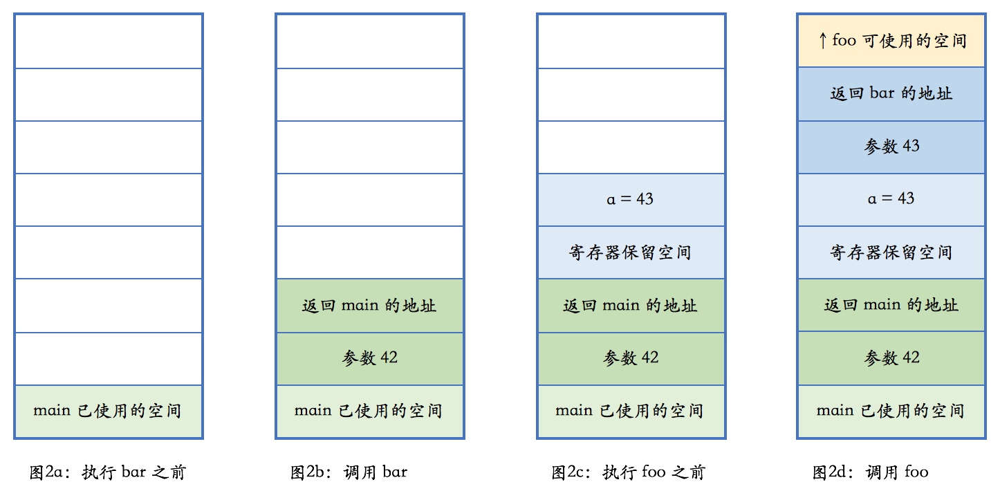

从技术上说，栈就是CPU寄存器里的某个指针所指向的一片内存区域。这里所说的“某个指针”通常位于x86/x64平台的ESP寄存器/RSP寄存器，以及ARM平台的SP寄存器

压栈（push）和弹栈（pop）就是堆寄存器进行地址加减的操作（32位步长为4，64位步长为8）


```shell
ulimit -s # 查看栈大小，本机是8192即8M。如果后面有参数就是设置栈空间大小
ulimit -a # 查看所有，包括文件句柄/奔溃文件大小/管道等等
```

递归申请栈空间，容易栈溢出

```c
#include<stdio.h>
#include<stdlib.h>

int   i = 1;  //记录申请的次数
void func()
{
    char   a[1048576];  //一次申请 1 M 便于计算

    printf("NO.%d  %ld 字节 %p\n",i,sizeof(a),a);

    i++;
    func();
}

main()
{
    // 第八次就会溢出段错误，因为栈里面还保存着其他数据
    func();
}

```

实际物理内存4G，设置栈空间大小为4G。当内存不够时会将不使用的内存数据**临时保存到交换空间**，此时容易卡死



栈是向上增长的，即栈地址是往低地址增长，从用户空间0xc0000000开始变小。


函数调用

参数及本函数地址压栈，然后跳转到调用的函数地址

```c++
void foo(int n){
	// do something
}

void bar(int){
	int a = n + 1;
	foo(a);
}

int main(){
	...
	bar(42);
	...
}
```




栈帧（stack frame）

**栈帧**也叫过程活动记录，是编译器用来实现过程/函数调用的一种数据结构。简言之，**栈帧**就是利用`EBP`（栈帧指针，**请注意不是ESP**）寄存器访问局部变量、参数、函数返回地址等的手段。

```assembly
;栈帧结构
PUSH EBP            ;函数开始（使用EBP前先把已有值保存到栈中）
MOV EBP, ESP        ;保存当前ESP到EBP中

...                 ;函数体
                    ;无论ESP值如何变化，EBP都保持不变，可以安全访问函数的局部变量、参数

MOV ESP, EBP        ;将函数的起始地址返回到ESP中
POP EBP             ;函数返回前弹出保存在栈中的值
RETN                ;函数终止
```

每一次函数的调用，都会在`调用栈`（call stack）上维护一个独立的`栈帧`（stack frame）。每个独立的栈帧一般包括：

- 函数的返回地址和参数
- 临时变量：包括函数的非静态局部变量以及编译器自动生成的其他临时变量
- 函数调用的上下文

栈是从高地址向低地址延伸，一个函数的栈帧用EBP和ESP这两个寄存器来划定范围。`EBP`指向当前栈帧的底部，`ESP`**始终指向**栈帧的顶部。

EBP寄存器又被称为`帧指针`（Frame Pointer）

ESP寄存器又被称为`栈指针`（Stack Pointer）

当打开优化选项：`-O`,`-O2`, `-O3`, `-Os` 时或者对某些平台不打开任何优化选项时，`-fomit-frame-pointer`会被默认打开，可以通过设置 `**-fno-omit-frame-pointer` 关闭 `-fomit-frame-pointer`**

对象不存栈的原因：

1. 对象太大
2. 对象在编译时无法
3. 不能直接返回对象（工厂方法）

