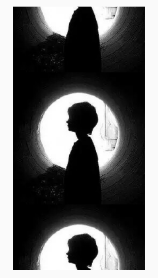

### Image

`Image` widget 有一个必选的`image`参数，它对应一个 ImageProvider。下面我们分别演示一下如何从 asset 和网络加载图片。

#### 从asset中加载图片

1. 在工程根目录下创建一个`images目录`，并将图片 avatar.png 拷贝到该目录。

2. 在`pubspec.yaml`中的`flutter`部分添加如下内容：

   ```yaml
     assets:
       - images/avatar.png
   ```

> 注意: 由于 yaml 文件对缩进严格，所以必须严格按照每一层两个空格的方式进行缩进，此处 assets 前面应有两个空格。

1. 加载该图片

   ```dart
   // v1
   Image(
     image: AssetImage("images/avatar.png"),
     width: 100.0
   );
   
   // v2
   Image.asset("images/avatar.png",
     width: 100.0,
   )
   ```

   

#### 从网络加载图片

```dart
// v1
Image(
  image: NetworkImage(
      "https://avatars2.githubusercontent.com/u/20411648?s=460&v=4"),
  width: 100.0,
)
    
// v2
Image.network(
  "https://avatars2.githubusercontent.com/u/20411648?s=460&v=4",
  width: 100.0,
)
```

#### 参数

`Image`在显示图片时定义了一系列参数，通过这些参数我们可以控制图片的显示外观、大小、混合效果等。我们看一下 Image 的主要参数：

```dart
const Image({
  ...
  this.width, //图片的宽
  this.height, //图片高度
  this.color, //图片的混合色值
  this.colorBlendMode, //混合模式
  this.fit,//缩放模式
  this.alignment = Alignment.center, //对齐方式
  this.repeat = ImageRepeat.noRepeat, //重复方式
  ...
})
```

- `width`、`height`：用于设置图片的宽、高，当不指定宽高时，图片会根据当前父容器的限制，尽可能的显示其原始大小，如果只设置`width`、`height`的其中一个，那么另一个属性默认会按比例缩放，但可以通过下面介绍的`fit`属性来指定适应规则。
- `fit`：该属性用于在图片的显示空间和图片本身大小不同时指定图片的适应模式。适应模式是在`BoxFit`中定义，它是一个枚举类型，有如下值：
  - `fill`：会拉伸填充满显示空间，图片本身长宽比会发生变化，图片会变形。
  - `cover`：会按图片的长宽比放大后居中填满显示空间，图片不会变形，超出显示空间部分会被剪裁。
  - `contain`：这是图片的默认适应规则，图片会在保证图片本身长宽比不变的情况下缩放以适应当前显示空间，图片不会变形。
  - `fitWidth`：图片的宽度会缩放到显示空间的宽度，高度会按比例缩放，然后居中显示，图片不会变形，超出显示空间部分会被剪裁。
  - `fitHeight`：图片的高度会缩放到显示空间的高度，宽度会按比例缩放，然后居中显示，图片不会变形，超出显示空间部分会被剪裁。
  - `none`：图片没有适应策略，会在显示空间内显示图片，如果图片比显示空间大，则显示空间只会显示图片中间部分。


`repeat`：当图片本身大小小于显示空间时，指定图片的重复规则。简单示例如下：

```dart
Image(
  image: AssetImage("images/avatar.png"),
  width: 100.0,
  height: 200.0,
  repeat: ImageRepeat.repeatY ,
)
```



