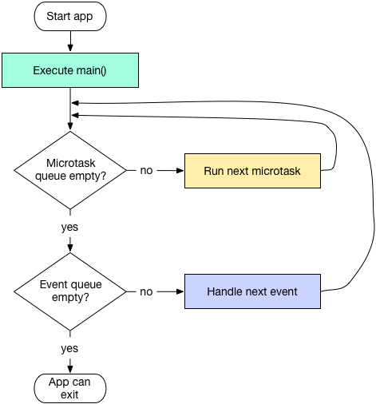

Dart 在单线程中是以消息循环机制来运行的，其中包含两个任务队列，一个是“微任务队列” **microtask queue**，另一个叫做“事件队列” **event queue**。从图中可以发现，微任务队列的执行优先级高于事件队列。

现在我们来介绍一下Dart线程运行过程，如上图中所示，入口函数 main() 执行完后，消息循环机制便启动了。首先会按照先进先出的顺序逐个执行微任务队列中的任务，事件任务执行完毕后程序便会退出，但是，在事件任务执行的过程中也可以插入新的微任务和事件任务，在这种情况下，整个线程的执行过程便是一直在循环，不会退出，而Flutter中，主线程的执行过程正是如此，永不终止。

在Dart中，所有的外部事件任务都在事件队列中，如IO、计时器、点击、以及绘制事件等，而微任务通常来源于Dart内部，并且微任务非常少，之所以如此，是因为微任务队列优先级高，如果微任务太多，执行时间总和就越久，事件队列任务的延迟也就越久，对于GUI应用来说最直观的表现就是比较卡，所以必须得保证微任务队列不会太长。值得注意的是，我们可以**通过`Future.microtask(…)`方法向微任务队列插入一个任务**。

### 异常捕获与日志收集

在Flutter中，还有一些Flutter没有为我们捕获的异常，如调用空对象方法异常、Future中的异常。在Dart中，异常分两类：同步异常和异步异常，同步异常可以通过`try/catch`捕获，而异步异常则比较麻烦，如下面的代码是捕获不了`Future`的异常的：

```dart
// 无法捕获
try{
    Future.delayed(Duration(seconds: 1)).then((e) => Future.error("xxx"));
}catch (e){
    print(e)
}

// 可以捕获
Future.delayed(Duration(seconds: 1)).onError((error, stackTrace) => print("error $error"));
```

Dart中有一个`runZoned(...)` 方法，可以给执行对象指定一个Zone。Zone表示一个代码执行的环境范围，为了方便理解，读者可以将Zone类比为一个代码执行沙箱，不同沙箱的之间是隔离的，沙箱可以捕获、拦截或修改一些代码行为，如Zone中可以捕获日志输出、Timer创建、微任务调度的行为，同时Zone也可以捕获所有未处理的异常。下面我们看看`runZoned(...)`方法定义：

```dart
R runZoned<R>(R body(), {
    Map zoneValues, 
    ZoneSpecification zoneSpecification,
}) 
```

- `zoneValues`: Zone 的私有数据，可以通过实例`zone[key]`获取，可以理解为每个“沙箱”的私有数据。

- `zoneSpecification`：Zone的一些配置，可以自定义一些代码行为，比如拦截日志输出和错误等，举个例子：

  ```dart
  runZoned(
    () => runApp(MyApp()),
    zoneSpecification: ZoneSpecification(
      // 拦截print 蜀西湖
      print: (Zone self, ZoneDelegate parent, Zone zone, String line) {
        parent.print(zone, "Interceptor: $line");
      },
      // 拦截未处理的异步错误
      handleUncaughtError: (Zone self, ZoneDelegate parent, Zone zone,
                            Object error, StackTrace stackTrace) {
        parent.print(zone, '${error.toString()} $stackTrace');
      },
    ),
  );
  ```

  这样一来，我们 APP 中所有调用`print`方法输出日志的行为都会被拦截，通过这种方式，我们也可以在应用中记录日志，等到应用触发未捕获的异常时，将异常信息和日志统一上报。

  另外我们还拦截了未被捕获的异步错误，这样一来，结合上面的 `FlutterError.onError` 我们就可以捕获我们Flutter应用错误了并进行上报了！

### [#](https://book.flutterchina.club/chapter2/thread_model_and_error_report.html#总结)总结

我们最终的异常捕获和上报代码大致如下：

```dart
void collectLog(String line){
    ... //收集日志
}
void reportErrorAndLog(FlutterErrorDetails details){
    ... //上报错误和日志逻辑
}

FlutterErrorDetails makeDetails(Object obj, StackTrace stack){
    ...// 构建错误信息
}

void main() {
  var onError = FlutterError.onError; //先将 onerror 保存起来
  FlutterError.onError = (FlutterErrorDetails details) {
    onError?.call(details); //调用默认的onError
    reportErrorAndLog(details); //上报
  };
  runZoned(
  () => runApp(MyApp()),
  zoneSpecification: ZoneSpecification(
    // 拦截print 蜀西湖
    print: (Zone self, ZoneDelegate parent, Zone zone, String line) {
      collectLog(line);
      parent.print(zone, "Interceptor: $line");
    },
    // 拦截未处理的异步错误
    handleUncaughtError: (Zone self, ZoneDelegate parent, Zone zone,
                          Object error, StackTrace stackTrace) {
      reportErrorAndLog(details);
      parent.print(zone, '${error.toString()} $stackTrace');
    },
  ),
 );
}
```
