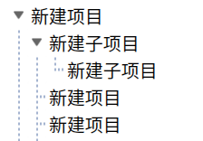

```css
/* 使用变量 */
$text = #222;
QFrame{
    color: $text;
}
```


```CSS
QTreeView::item:selected,
QTreeView::branch:selected{
      background-color:white;
}

QTreeView::branch:!has-children:!has-siblings:adjoins-item {
	border-image: none;
}

QTreeView::branch:has-children:!has-siblings:closed,
QTreeView::branch:closed:has-children:has-siblings {
	min-width:24px;
	min-height :24px;
	font:24px "思源黑体 CN Regular";
    border-image: none;
	image: url(:/j5Maintain/Resources/images/tree_ldown_nor.png);
}

QTreeView::branch:open:has-children:!has-siblings, 
QTreeView::branch:open:has-children:has-siblings  {
	min-width:24px;
	min-height:24px;
	font:24px "思源黑体 CN Regular";
	border-image: none;
	image: url(:/j5Maintain/Resources/images/tree_ldown_click.png);
}

QTreeView::branch:has-siblings:!adjoins-item {
	border-image:url(:/j5Maintain/Resources/images/vline.png);
}

QTreeView::branch:has-siblings:adjoins-item 
 {
	border-image:url(:/j5Maintain/Resources/images/branch-more.png);
 }

QTreeView::branch:!has-children:!has-siblings:adjoins-item
 {
	border-image:url(:/j5Maintain/Resources/images/branch-end.png);
 }
```

效果：



```css
    background-image:url('paper.gif');
	/* repeat-y垂直方向重复    no-repeat不重复*/
    background-repeat:repeat-y;	
	/* 起始位置 qt不支持像素（px）和百分比（%）*/
	background-position: left center; 
```


