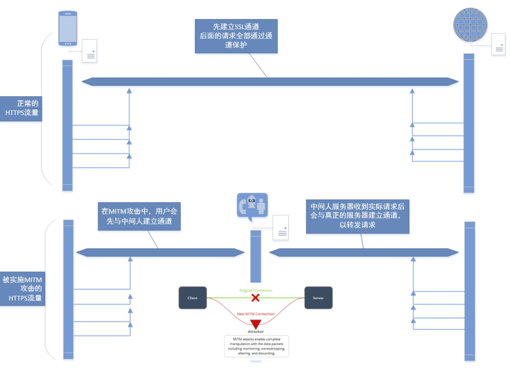
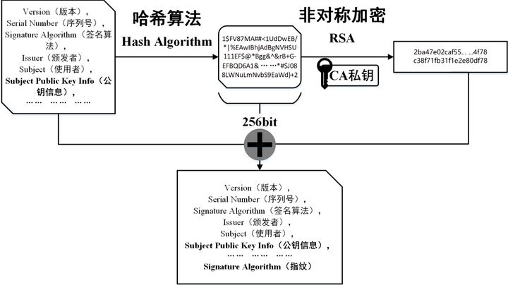
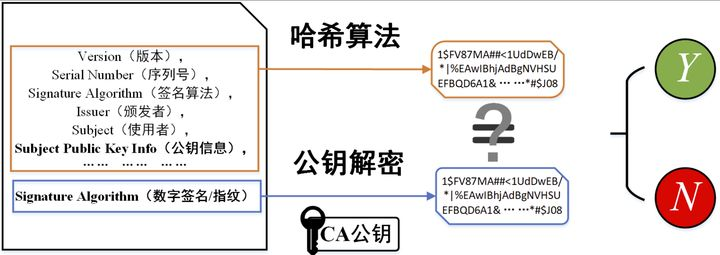
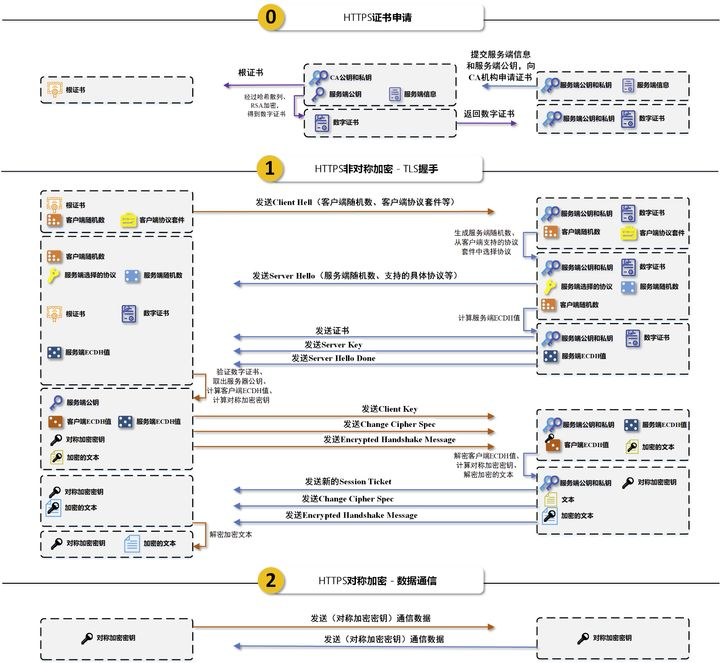

### **HTTPS 为什么同时要有对称加密和非对称加密两种加密方式？**

默认各位同学已经知晓对称加密和非对称加密（了解基本原理即可），不清楚的同学推荐阅读知乎文章-《[对称加密与非对称加密](https://zhuanlan.zhihu.com/p/30573146)》，文章最后指出了这两个加密方式的优缺点，原文如下：

> （1）对称加密加密与解密使用的是同样的密钥，所以速度快，但由于需要将密钥在网络传输，所以安全性不高。
> （2） 非对称加密使用了一对密钥，公钥与私钥，所以安全性高，但加密与解密速度慢。

那么解决办法有吗？有，文章随后说道：

> （3）解决的办法是将对称加密的密钥使用非对称加密的公钥进行加密，然后发送出去，接收方使用私钥进行解密得到对称加密的密钥，然后双方可以使用对称加密来进行沟通。

### **HTTPS 对称加密的密钥 SK 如何产生和传输？**

通过第一个问题，我们知道了 HTTPS 分为**2 个过程**：

1. 协商对称加密密钥 SK 的非对称加密阶段，称为**TLS 握手阶段**。
2. 使用 SK 对数据（对话内容）进行对称加密的阶段，称为**数据通信阶段**。

### **为什么是数字证书呢？**

HTTPS 已经对通信数据进行了加密，为什么还要验证身份？说好的“人与人之间最基本的信任呢？”

这还不是因为各路黑客、骇客们总是在制造各种攻击吗？（捂脸）其中一个大名鼎鼎的**中间人攻击（Man-In-The-Middle Attack，MITM 攻击）**，简单的讲，“中间人”在客户端和服务端都不知情的情况下，夹在双方之间窃听甚至篡改通信信息



可见，在 HTTPS 中，“**确保对端身份正确**”即“**确保拿到的公钥正确**”，而在网络通信中所谓的“**身份**”，一般指的是通信一端的**域名**、**IP 地址**甚至是**Mac 地址**。所以，**数字证书**同时包含了通信一端的**身份信息**和**公钥信息**。

但是数字证书会在网络中传输（由被要求验证身份的一端通过网络传给另一端），这就意味着证书也可能会被窃取篡改。这个时候权威的 CA 机构就出马了，他想了个办法：加了一个“**防伪标识**”— **数字签名**。具体做法如下：

```c
signature = RSA(PriKey_CA, Hash(message))
```

这里啰嗦几句：**数字签名生成过程是首先对原文作哈希，把一段不定长的文本映射成固定长度的字符空间，接着再用 CA 机构的私钥对这段定长字符做加密。大大提高了整体的运算效率**


### **证书是怎么工作的？**

要了解证书是怎么做“身份验证”，即“防冒充”，得从 2 个角度来说明：

- **申请证书**，即需要被验证身份的一端，需要申请一份能够验证自己身份的证书
- **验证证书**，即需要验证对方身份的一端，拿到证书后验证对端的身份

请注意，这里有一个前提：**这张证书必须是由权威 CA 机构颁发的，且尚在有效期内；或者是一张信任的私人证书**。

**申请证书**

CA 机构和证书的分类本文不讨论，推荐阅读《[细说 CA 和证书](https://link.zhihu.com/?target=https%3A//www.barretlee.com/blog/2016/04/24/detail-about-ca-and-certs/)》，这里我们讨论正规权威 CA 机构签发的证书，至于是 DV、OV 还是 EV，只是安全强度问题，工作原理是一样的。

总结申请证书的过程：**用户向 CA 机构提交自己的信息（如域名）和公钥（用户自己生成的非对称加密公钥，用于 TLS 握手阶段和另一端协商密钥用），CA 机构生成数字证书**，如下图：



**验证证书**

收到对端发过来的证书，执行证书申请的“逆过程”即可，总结如下图：



接受证书的一端先对除数签名的其他部分做一次相同的哈希算法（证书中指明了哈希算法），得到这段文本的哈希映射，记作 H1；获取 CA 机构的公钥对数字签名属性做解码，得到了 CA 机构计算出的哈希映射，记作 H2。对比 H1 和 H2 两个字符串是否严格相等，若是，代表该证书的信息未被篡改，证书有效；否则，证书内容被篡改，证书无效。

若证书有效，接受端会再进行对端的**身份校验（验证域名）**，若身份验证通过，接收端会拿**证书上的公钥（也是对端自己生产的非对称加密公钥）**加密接下来整个 TLS 握手阶段的信息之后，发送给对端。

这个过程中有一个问题：**CA 机构的公钥怎么获取？**

回答：**提前内置。**

众所周知，操作系统和浏览器在软件安装阶段会在其特定目录下放置一堆的证书。如 Windows 的根证书管理在 certmgr 下：

**“为什么有这么多不同后缀名的证书啊？他们有什么联系和区别？”**

回答这个问题要从 3 个层面来分析：

- **证书标准**
- **证书编码格式**
- **文件扩展名**

**证书标准**

数字证书的格式普遍采用的是 X.509 国际标准，维基百科对于 X.509 解释如下：

> X.509 是密码学里公钥证书的格式标准。X.509 证书已应用在包括 TLS/SSL 在内的众多网络协议里，同时它也用在很多非在线应用场景里，比如电子签名服务。X.509 证书里含有公钥、身份信息（比如网络主机名，组织的名称或个体名称等）和签名信息（可以是证书签发机构 CA 的签名，也可以是自签名）。对于一份经由可信的证书签发机构签名或者可以通过其它方式验证的证书，证书的拥有者就可以用证书及相应的私钥来创建安全的通信，对文档进行数字签名。
> X.509 是 ITU-T 标准化部门基于他们之前的 ASN.1 定义的一套证书标准。

**证书的编码格式**

X.509 标准的证书文件具有不同的编码格式：PEM 和 DER。

1. **PEM**
   **PEM**，全称 Privacy Enhanced Mail，以文本格式存储，以 -----BEGIN
   XXX-----开头、-----END XXX-----结尾，中间内容是
   BASE64 编码数据。其文本内容大概如下：
   `html -----BEGIN CERTIFICATE----- Base64编码过的证书数据 -----END CERTIFICATE-----`

通常，PEM 格式可以存储公钥、私钥、证书签名请求等数据。查看 PEM 格式证书的信息一般采用如下命令：

```text
openssl x509 -in xxx.pem -text -noout
```

Apache 和 Nginx 服务器偏向于使用这种编码格式.

1. **DER**
   **DER**，全称 Distinguished Encoding
   Rules，以二进制存储，因此文件结构无法直接预览，只能通过如下命令查看：
   `html openssl x509 -in xxx.der -inform der -text -noout`
   DER 格式也可以存储公钥、私钥、证书签名请求等数据。Java 和 Windows 应用偏向于使用这种编码格式。

当然同一 X.509 证书的不同编码之间可以互相转换：

- PEM 转为 DER：
  openssl x509 -in xxx.pem -outform der -out xxx.der
- DER 转为 PEM：
  openssl x509 -in xxx.der -inform der -outform pem -out xxx.pem

**文件扩展名**

不同的扩展名可以分为以下几类：

- **证书**：存放数字证书，X.509 标准，格式可能是 PEM 或 DER。.crt、.cer

- **密钥**：用来存放一个 RSA 公钥或私钥，这类文件不是 X.509 标准，但是是 PEM 或 DER 格式。后缀名有.key。

- **证书+密钥**：可同时存放证书和 RSA 公钥/.pem、.der、.p12

- **证书请求**：并不是证书，而是证书签名请求。csr

  

### **完整性校验：HTTPS 的哈希**

**哈希**，键值对数据结构，通过哈希函数把一个空间映射到另一个空间。非常好用的一个工具，而且哪哪儿都有它的影子，比如负载均衡的一致性哈希、密码学中用于信息加密或数据校验的各种哈希（SHA、MD5 等）、二维空间定位的 GeoHash、对象相似度的 SimHash 等等。

HTTPS 的的哈希一共用在 2 个地方：

### **证书的数字签名**

具体做法在上文证书一章节已经说过，不再赘述。在这里使用哈希的目的主要是为了减少非对称加密算法 RSA 在长文本上的开销。

### **对称加密的 Message Digest**

在数据通信阶段，SSL/TLS 会对原始消息（message）做一次哈希，得到该消息 message 的摘要，称为**消息摘要（Message Digest）**。对端接受到消息后，使用协商出来的对称加密密钥解密数据包，得到原始消息 message；接着也做一次相同的哈希算法得到摘要，对比发送过来的消息摘要和计算出的消息摘要是否一致，可以判断通信数据是否被篡改。


**完整HTTPS通信流程**

