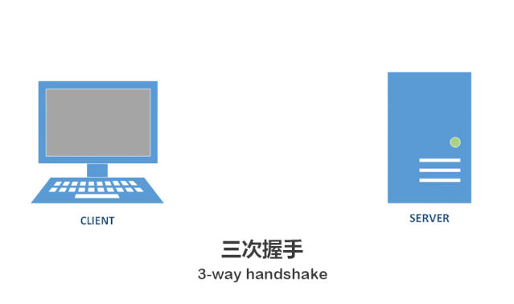

### 概念

其中比较重要的字段有：

（1）序号（sequence number）：Seq序号，占32位，用来标识从TCP源端向目的端发送的字节流，发起方发送数据时对此进行标记。

（2）确认号（acknowledgement number）：Ack序号，占32位，只有ACK标志位为1时，确认序号字段才有效，Ack=Seq+1。

（3）标志位（Flags）：共6个，即URG、ACK、PSH、RST、SYN、FIN等。具体含义如下：

> URG：紧急指针（urgent pointer）有效。
>
> ACK：确认序号有效。
>
> PSH：接收方应该尽快将这个报文交给应用层。
>
> RST：重置连接。
>
> SYN：发起一个新连接。
>
> FIN：释放一个连接。

需要注意的是：

> 不要将确认序号Ack与标志位中的ACK搞混了。确认方Ack=发起方Seq+1，两端配对。

### 三次握手

图中小写的ack即为确认号，确认号通常为SYN的seq+1。

#### 动态演示

#### 客户端和服务端打电话
客户端：服务端你能听见吗
服务端：哎，能听见，你能听见我说话吗
客户端：能听见，有点事找你(如果没有这一步，服务端并不知道客户端是否能听见)

### 四次挥手

#### 客户端和服务端打电话
客户端：我的事说完了，有事情你说我听着，没什么事挂了哈
服务端：好的知道了，（好的，我还要和你说个事，你妈叫你回家吃饭）
服务端：行了挂了吧
客户端：哦，知道了，那我挂了

前"两次挥手"既让服务器端知道了客户端想要释放连接，也让客户端知道了服务器端了解了自己想要释放连接的请求。于是，可以确认关闭客户端到服务器端方向上的连接了

第三次挥手重发ACK ack号跟第二次一致

### 为什么不是4次握手

首先我们知道TCP是3次握手与4次挥手，为什么不是4次握手呢，因为其中握手请求同步过程中并不需要数据传输因此将两次合并为一次了

> 如果客户端在2MSL内，再次收到了来自服务器端的FIN报文，说明服务器端由于各种原因没有接收到客户端发出的ACK确认报文。客户端再次向服务器端发出ACK确认报文，计时器重置，重新开始2MSL的计时；
>
> 否则客户端在2MSL内没有再次收到来自服务器端的FIN报文，说明服务器端正常接收了ACK确认报文，客户端可以进入CLOSED阶段，完成“四次挥手”。

握手和挥手的区别是发送的请求是SYN和FIN

### 等待2MSL

首先我们要知道MSL（Maximum Segment Lifetime）代表的是最大报文时间，值报文在网络中所能存在的最大时长，因此可以理解如果过去了2MSL那么就表示服务器肯定没有收到客户端所发送的应答报文，那么就需要重发

#### 客户端和服务端打电话(如果没有2MSL等待)
客户端：我的事说完了，有事情你说我听着，没什么事挂了哈
服务端：好的知道了，（好的，我还要和你说个事，你妈叫你回家吃饭）
服务端：行了挂了吧
客户端：哦，知道了，那我挂了
（上面这一句因为信号不好等原因服务端没收到客户端就挂了电话）后面有事情又拨通了服务端电话（建立了新连接）
服务端：挂了吧
客户端：怎么回事，蛇精病啊，刚通了就让我挂

### 状态机

